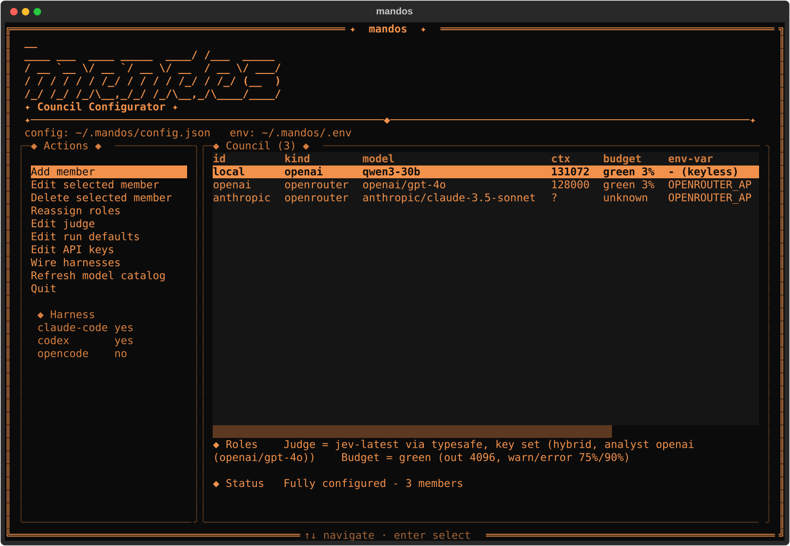

# Mandos

A multi-model deliberation MCP server. A panel of models answers your question, a
calibrated decision model judges what they established, and your own model writes the
answer from the evidence and the numbers.

The approach is OpenRouter's. Their [Fusion
router](https://openrouter.ai/blog/announcements/fusion-beats-frontier/) showed that a
panel of models with an analysis stage beats the frontier models it is built from, and
[documents how](https://openrouter.ai/docs/guides/routing/routers/fusion-router).
Mandos runs that shape as a local MCP server and changes the analysis stage: the judge
is [Jev](https://typesafe.ai/blog/introducing-system-one-models-and-jev), which returns
calibrated probabilities rather than prose.

Over 16 questions whose answers each turn on a fact nobody was given, a panel reaches
15/16 and 16/16 where the same model alone reaches 12/16 and 11/16. Those questions test
one specific failure, a model answering confidently without the information the answer
depends on, which is common and hard to catch. They say nothing about reasoning tasks in
general. [Full benchmark, with caveats](https://fox-islam.github.io/mandos/).

## Quick start

Install. The script bootstraps [`uv`](https://docs.astral.sh/uv/), resolves Python
3.13, and needs no checkout:

```bash
# macOS / Linux
curl -fsSL https://raw.githubusercontent.com/Fox-Islam/mandos/main/scripts/install.sh | sh
```

```powershell
# Windows
irm https://raw.githubusercontent.com/Fox-Islam/mandos/main/scripts/install.ps1 | iex
```

Configure. This opens the full-screen configurator, where you add panel members, set
the judge, and wire your harness:

```bash
mandos
```



Then use it. In Claude Code, Codex or OpenCode:

```
/council Should we move the job queue off Postgres LISTEN/NOTIFY?
```

Your model calls the `mandos` tool, the panel answers, the judge scores what they
established, and your model writes the answer. `mandos doctor` shows the resolved
roster and what is wired, without printing secrets.

You need one key for the judge and one per panel provider. See [Getting a Jev
key](#getting-a-jev-key) and [Configuration](#configuration).

## Install in detail

Each script installs `uv` if absent, resolves or installs Python 3.13, removes any
previous `mandos` uv tool environment, reinstalls with the resolved interpreter, and
verifies `mandos --help` before finishing. That puts two commands on your PATH:
`mandos` (the configurator TUI) and `mandos-mcp` (the MCP stdio server your harness
spawns). Until a PyPI release exists this git-URL install needs `git` on PATH; the
installer checks up front.

The configurator writes `~/.mandos/config.json` and `~/.mandos/.env` (0600), and wires
the harnesses you pick. `mandos refresh-catalog` updates the local models.dev cache.
Sessions live in `~/.mandos/sessions/`; clear them with `mandos clear-sessions
[thread_id]` or the `mandos_clear_sessions` tool.

## Getting a Jev key

Jev is served by TypeSafe directly and through OpenRouter's decisions endpoint. The
request and answer bodies are identical; the provider only decides the host, the path
and which variable holds the key.

| | TypeSafe | OpenRouter |
|---|---|---|
| Host / path | `api.typesafe.ai` `/v1/systemone` | `openrouter.ai` `/api/alpha/decisions` |
| Key | `TYPESAFE_API_KEY` | `OPENROUTER_API_KEY` |
| Per-call cost reported | no | yes, folded into `meta.cost_basis.jev_usd` |

Set `judge.provider` and leave `judge.api_key_env` unset to let the key follow the
provider. `judge.base_url` overrides the host for a self-hosted or proxied endpoint.

## Letting the panel see the conversation

An MCP server sees only its tool arguments, so by default the panel is briefed on
whatever your model retyped into `prompt` and `context`. The optional capture hook
fixes that from the harness side: on each user prompt it writes the recent turns to
`~/.mandos/context/` and exits — no API call, nothing blocking, no classifier deciding
whether a turn "needs" a council. When your model chooses to convene one, the server
reads that file.

```bash
mkdir -p ~/.mandos/hooks
cp scripts/hooks/capture_transcript.py ~/.mandos/hooks/
```

```json
{
  "hooks": {
    "UserPromptSubmit": [
      {"hooks": [{"type": "command",
                  "command": "python3 ~/.mandos/hooks/capture_transcript.py"}]}
    ]
  }
}
```

Credentials are stripped before anything is written, the capture is bounded by turns
and characters, and one older than an hour is ignored as belonging to a different task.
`context.from_transcript: false` disables it; `use_conversation: false` blinds a single
call. If your panel is off-prem, so is the conversation — see
[`docs/architecture/05-security.md`](docs/architecture/05-security.md).

## Why a decision model judges better than a chat model

An LLM-as-judge writes `"consensus": ["all three agree X is safe"]` and you have no
way to check it. It is one more generation, with the same failure modes as the
answers it is grading: it smooths disagreement into agreement, it is confidently
wrong at the same rate, and it reports its certainty as an adjective.

Jev cannot write that sentence. It answers named questions in fixed shapes — a
probability for a yes/no, a label with a distribution, a level on a rubric — so the
judge stage produces measurements rather than assertions. Four consequences:

- **The analysis is checkable.** Every finding carries the support floor, the
  contested probability and the confidence it was derived from.
- **There is no JSON to salvage.** No fenced code blocks, no truncated objects, no
  `judge_error` from a model that decided to preamble.
- **It is fast and it batches.** Jev answers a whole batch in parallel, so question
  count is nearly free: measured here, a 6-question judgement and a 44-question one
  both land near 420ms, because a call costs its round trip and almost nothing per
  question. A whole panel is adjudicated in one call for about $0.0002.
- **Asking more costs nothing, so it asks more.** Because questions are free, the
  judge also reads each answer for hedging, scope and distinctiveness, and reports
  what the panel said it was *missing* — see below.

## The four judge shapes

Set `judge.shape` in config, or pass `analysis_model` per call.

| shape | what runs | what you get |
|---|---|---|
| **`hybrid`** *(default)* | an analyst proposes claims, Jev decides them | the full narrative schema, every finding carrying its numbers |
| **`matrix`** | Jev alone | pairwise agreement, per-answer rubrics, the outlier — no prose, no generative model anywhere |
| **`verify`** | the analyst writes, Jev grades what it wrote | each finding keeps its place and gains a probability that it holds |
| **`probe`** | no deliberation; one cheap call lists what the answers lacked, Jev scores it | `needs_evidence` only |
| **`llm`** | the analyst alone | uncalibrated, Fusion-style; the fallback |

Only `matrix` needs no chat model for the judge role, and it is the one to pick when
no generative model should touch the loop at all — though with a two-member panel it
has little to measure, so a self-panel wants `hybrid`.

`probe` is the shape for a question that turns on a missing fact rather than on a
disagreement. It skips claim adjudication entirely, so it costs less than `hybrid` and
works with a panel of one. It reports nothing about where models differ, which is what
`hybrid` is for.

Each shape falls back in order until one delivers: `hybrid` tries `matrix` before
`llm`, because an analyst that is unreachable or that proposed nothing says nothing
about whether Jev is reachable. `meta.judge_shape` reports what ran and
`meta.judge_fallback_from` what was asked for.

All three Jev shapes score every finding correctly and stably against the fixture in
[`docs/architecture/03-judge-shapes.md#measured`](docs/architecture/03-judge-shapes.md),
which is also where the default comes from.

## When the panel doesn't have enough to go on

The judge reports what the panel **lacked**, not just what it failed to mention:

```
**The panel was missing** (fetch and re-run if it matters)
- the actual distribution of values in the status column _(would change the answer 0.91; lacked 0.95)_
- the current EXPLAIN ANALYZE output for the query _(would change the answer 0.86; lacked 0.88)_
```

That is different from a blind spot. A blind spot is something nobody addressed; this
is something nobody *could* address, because it was not in front of them — and it is
the only one of the two a caller can act on, by fetching it and asking again.

It is a field, never a failure. The first pass still returns a real analysis; whether
to go and get the evidence is your model's decision, and `depth` caps the chain if it
does. This matters because a panel reasoning without the decisive fact is worse than
no panel: measured over 8 such questions, the author scored 7/8 alone, **6/8** with an
uninformed panel, and **8/8** once the panel's own request was answered and it was
asked again.

## What differs from Fusion

Mandos keeps Fusion's shape: a panel of 1–8 models in parallel, an analysis stage, and
your own model as the final author. The analysis schema is deliberately the same —
consensus, contradictions, partial coverage, unique insights, blind spots — so the two
stay comparable.

| | Fusion | Mandos |
|---|---|---|
| Judge | your outer model, generative | Jev, a calibrated decision model |
| Analysis | asserted | measured, with the numbers returned |
| Panel tools | `web_search` + `web_fetch` per panellist | provider-executed tools passed through per provider; nothing client-side |
| Panel input | your actual conversation | the conversation, via a capture hook, plus what your model passes |
| Hosting | OpenRouter, one key | your own OpenAI-compatible providers, on-prem capable |

The remaining gap is local data. A panel member can be given provider-side web search
(`tools: [{ type: "openrouter:web_search" }]` on the provider), and a capture hook
gives it the conversation, but nothing reaches your files, shell or database on its own — the harness holds that access behind a permission model that asks
first, and an MCP subprocess running tools to feed a third-party panel would route
around it. Local evidence gets to the panel because the calling model gathers it and
passes it as `context`, where those prompts still apply.

The judge closes the loop on that: `analysis.needs_evidence` reports what the panel
found itself lacking, with how likely having it would change the answer. Rather than
guessing what to include up front, the calling model reads what the panel actually
needed, fetches it, and asks again.

## Repository layout

```
orchestrator/        the service package
  mcp_server.py      FastMCP server — tools: mandos, mandos_status, mandos_clear_sessions; council prompts
  panel.py           panel fan-out (partial results + degradation) and Markdown rendering
  jev/               the Jev client: wire format, question primitives, provider switch
  judge/             the four shapes, their shared question sets, and the dispatcher
  transcript.py      conversation capture: redaction, bounds, staleness
  attribution.py     labels OpenRouter calls as Mandos, and no other host
  http.py            one pooled HTTP client for the process, shared across deliberations
  model_catalog.py   offline-first model metadata and pricing, models.dev parser, cache
  budget.py          advisory context-budget estimates
  sessions.py        local council-session store, message reconstruction, age pruning
  providers/         single OpenAI-compatible chat provider kind + factory
  settings.py        JSON/YAML + env config; the judge, context and provider blocks
  models.py          Pydantic request/response models, Calibration and NeedsEvidence
  interfaces.py      Protocol seams; fakes.py — deterministic test doubles
  costing.py         cost estimation; json_utils.py — tolerant JSON for the llm judge
  cli/               the mandos configurator: TUI, catalog, config ops, secrets, probe, harness/
  tests/             pytest suite (respx for HTTP, deterministic Jev fake, opt-in live)
config/              mandos.example.yaml (providers, judge, context, presets, pricing)
scripts/             install.sh, install.ps1, stdio smoke, hooks/capture_transcript.py
docs/architecture/   live architecture, judge shapes, configuration, security, deployment
.agents/skills/      mandos-deliberate skill
```

## Design (source of truth)

[`docs/architecture/`](docs/architecture/) — overview, pipeline, judge shapes,
configuration reference, security, deployment, dependencies.

## Develop

Requires **Python 3.13**.

```bash
python -m venv .venv
./.venv/bin/python -m pip install -r orchestrator/requirements-dev.txt

./.venv/bin/ruff check orchestrator           # lint
./.venv/bin/ruff format --check orchestrator  # style gate (CI enforces)
./.venv/bin/python -m pytest                  # tests

./.venv/bin/python -m orchestrator.mcp_server # run the MCP server over stdio
MANDOS_SOURCE="$(pwd)" ./scripts/install.sh   # install/test from this checkout
```

On Windows: `.\scripts\install.ps1 -Source .`

The default suite is offline: `orchestrator/fakes.py` ships a deterministic fake that
answers every question in the shape it was asked, so the suite measures the judge's
reasoning from probabilities rather than Jev's accuracy.

```bash
./.venv/bin/python -m pytest -m live      # needs a Jev key; a few thousandths of a cent
```

The live fixture pins the judge's reading of a fixed panel with a known correct answer.
It exists because the support thresholds were measured rather than chosen, and one of
them had to move when a live run showed the panel's sharpest disagreement vanishing on
a third of attempts. Nothing offline catches that regressing — the fake answers
whatever it is told to.

## Configuration

Run `mandos` to write `~/.mandos/config.json` and `~/.mandos/.env` (0600). The in-repo
`config/mandos.example.yaml` is illustrative. Both JSON and YAML are supported by
extension; the TUI writes JSON. **Secrets live only in env vars referenced by name**
(`api_key_env`) — never in the config file, never logged, never returned by
`mandos_status`.

Resolution: `--config <path>` → `MANDOS_CONFIG` → `./mandos.{json,yaml}` →
`~/.mandos/config.{json,yaml}`.

Four blocks: `judge` (shape, Jev provider, model, key variable), `context` (what the
panel is told about the conversation), `providers` (the roster, their roles and any
provider-executed tools) and `defaults` (deadlines, token ceilings, budget ratios,
session retention). `pricing` is optional — costs come from the model catalog when a
provider is not listed there, so `meta.cost_estimate_usd` is real without a
hand-maintained table.

## Integration

Per-harness setup (Claude Code, Codex, OpenCode) is wired by the configurator. Every
entry launches `mandos-mcp` over stdio with `MANDOS_CONFIG` pointed at
`~/.mandos/config.json`. For manual snippets see
[`docs/architecture/06-deployment.md`](docs/architecture/06-deployment.md).

A deliberation is one blocking tool call that can run to the full `timeout_s`, so it
reports progress as each panel member lands and again when the judge finishes. Several
councils may be in flight at once: they share one pooled HTTP connection pool, and
concurrent turns on a single `thread_id` serialise while different threads do not
block each other.

## License

[MIT](LICENSE). See also `SECURITY.md`, `CONTRIBUTING.md`, `THIRD-PARTY-NOTICES.md`.
