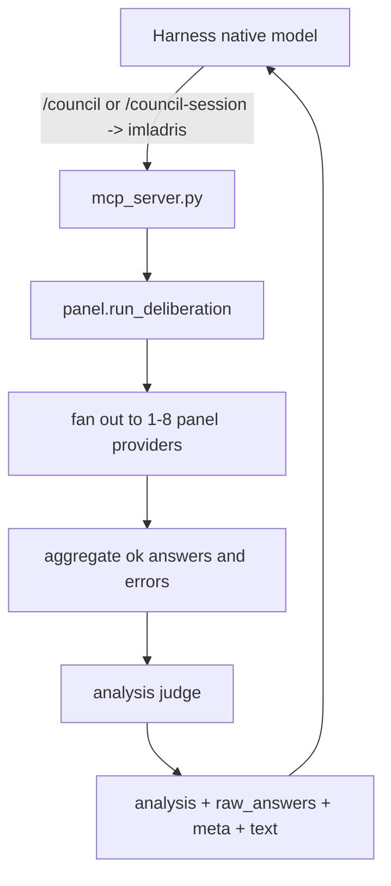

# Architecture Overview

> This document is the source of truth for the live architecture after the 2026-06-19
> simplification: **panel -> analysis judge -> host author**.

## 1. Purpose

Imladris is a self-hosted multi-model deliberation MCP server. A harness calls
the `imladris` tool, the server fans the prompt out to a configured panel of
OpenAI-compatible providers, an API-side judge analyzes the successful answers,
and the harness's native model authors the final response from the returned
`analysis` plus all `raw_answers`.

The native model is always the final author. Imladris does not use MCP sampling
to call back into the harness model, and it does not synthesize final prose.

## 2. Components

- `orchestrator/mcp_server.py` exposes `imladris`, `imladris_status`,
  `imladris_clear_sessions`, and the `/council` / `/council-session` prompts over
  FastMCP stdio. There is no HTTP server.
- `orchestrator/panel.py` resolves the effective panel, builds a `ChatRequest`
  per panel member (identical for one-shot; per-provider session messages in session
  mode), reconstructs session `messages[]` when `thread_id` is present, records
  partial failures, runs the analysis judge when at least one member succeeds,
  estimates cost/budget, and renders Markdown.
- `orchestrator/judge.py` performs one temperature-0 analysis call. The judge sees
  real provider ids and returns only the `Analysis` JSON schema.
- `orchestrator/model_catalog.py` resolves model metadata from a bundled seed plus a
  JSON cache without running third-party package code; refresh is an explicit CLI/TUI
  configurator path, while runtime deliberation stays cache/seed-only.
  `orchestrator/budget.py` estimates advisory context pressure for runtime metadata,
  `imladris_status`, and the dashboard gauge.
- `orchestrator/sessions.py` stores local council-session history under
  `~/.imladris/sessions/<thread_id>.json`, reconstructs OpenAI `messages[]`, and
  compacts older turns when needed.
- `orchestrator/providers/openai_compatible.py` is the single provider kind.
  The configured `base_url` is the API base and the OpenAI SDK appends
  `/chat/completions`.
- `orchestrator/settings.py` validates JSON/YAML config with roles limited to
  `panel` and `judge`, budget defaults, and manual/discovered context-window
  fields. Legacy `curator`, `curation_model`, `anonymize`, and `include_raw`
  config fields are stripped on load with a warning.
- `orchestrator/models.py` defines the request/response contract. The response is
  `question`, `panel[]`, optional `analysis`, unconditional `raw_answers[]`,
  `meta`, Markdown `text`, `thread_id` (echoed from the request when present), and
  `compacted` (true when the session history was trimmed to fit context).
- `orchestrator/costing.py` estimates advisory USD cost over panel and judge calls;
  results are attached to `meta` and used by the TUI dashboard gauge.
- `orchestrator/observability.py` configures structlog for stderr-only structured
  logging with secret redaction; called once at startup in `mcp_server.main()`.
- `orchestrator/json_utils.py` provides tolerant JSON parsing (fence-strip,
  preamble-strip) used by `judge.py` to degrade gracefully on malformed judge output
  rather than crashing.

## 3. Data Flow

1. `mcp_server.imladris()` builds a `DeliberateRequest` from the tool arguments.
2. `panel.run_deliberation()` applies the depth guard and resolves the panel from
   the request, selected preset, or enabled panel providers.
3. One-shot calls send the same system/user messages to each panel provider.
   Session calls load the local session file, close the prior turn from
   `prior_answer` when present, and send reconstructed `messages[]`.
   Provider errors are recorded as `PanelAnswer(status="error")`; they do not fail
   the batch.
4. If no panel member succeeds, Imladris returns `meta.failure =
   all_panels_failed` and no analysis.
5. If at least one panel member succeeds, `judge.run_deliberation_judge()` analyzes
   the successful raw answers.
6. The response always includes all successful raw answers. If judge parsing fails,
   `meta.judge_error` is set and raw answers still return.



## 4. Configuration

Providers may have `panel`, `judge`, or both roles. Presets use:

```yaml
presets:
  quality:
    panel: [local, provider-b]
    analysis: local
```

Secrets stay env-only via `api_key_env`; values live in `~/.imladris/.env` and
are never returned by `imladris_status`.

## 5. Boundaries

- Imladris is not a gateway or router.
- It has no REST, Docker, or exposed port surface.
- One-shot `/council` remains stateless apart from the per-request depth guard.
- `/council-session` is stateful on the MCP host only; its file contents are still
  sent to the configured panel providers on each session turn.
- Context budgets are advisory; unknown windows degrade to `unknown`, not a block.
