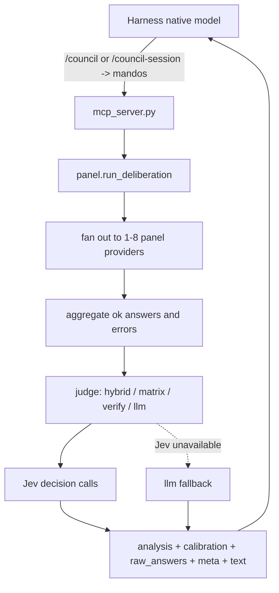

# Architecture Overview

> This document is the source of truth for the live architecture:
> **panel -> Jev judge -> host author**.

## 1. Purpose

Mandos is a self-hosted multi-model deliberation MCP server. A harness calls the
`mandos` tool, the server fans the prompt out to a configured panel of
OpenAI-compatible providers, and **Jev** — TypeSafe's System One decision model —
is asked named questions about what the answers established. The harness's native
model then authors the final response from the returned `analysis` plus all
`raw_answers`.

The judge is the point of the project. A generative analyst asserts a consensus you
cannot check; Jev answers in fixed shapes — a probability for a yes/no, a label with a
distribution, a level on a rubric — so the analysis is measured rather than claimed,
and every finding is returned with the numbers behind it. The generative analyst
survives as `judge.shape: "llm"` and as the fallback when Jev cannot deliver.

The native model is always the final author. Mandos does not use MCP sampling to call
back into the harness model, and it does not synthesize final prose.

## 2. Components

- `orchestrator/mcp_server.py` exposes `mandos`, `mandos_status`,
  `mandos_clear_sessions`, and the `/council` / `/council-session` prompts over
  FastMCP stdio. There is no HTTP server.
- `orchestrator/panel.py` resolves the effective panel, builds a `ChatRequest`
  per panel member (identical for one-shot; per-provider session messages in session
  mode), reconstructs session `messages[]` when `thread_id` is present, records
  partial failures, runs the analysis judge when at least one member succeeds,
  estimates cost/budget, and renders Markdown.
- `orchestrator/jev/` is the Jev client: the `{state, model, questions}` wire format,
  the three question primitives (`noul`, `choice`, `score`) with tolerant answer
  readers, deadline-aware retries, and the TypeSafe/OpenRouter provider switch. Every
  failure is a recorded error, never an exception into the batch.
- `orchestrator/judge/` holds the four shapes behind one dispatcher: `hybrid.py`
  (an analyst proposes claims, Jev decides them), `matrix.py` (Jev alone),
  `verify.py` (the analyst writes, Jev grades it), `llm.py` (the generative analyst,
  temperature 0, returning the `Analysis` schema). `extract.py` is hybrid's claim
  proposer; `outcome.py` is the single result type every shape returns.
- `orchestrator/model_catalog.py` resolves model metadata from a bundled seed plus a
  JSON cache without running third-party package code; refresh is an explicit CLI/TUI
  configurator path, while runtime deliberation stays cache/seed-only.
  `orchestrator/budget.py` estimates advisory context pressure for runtime metadata,
  `mandos_status`, and the dashboard gauge.
- `orchestrator/transcript.py` reads and writes the conversation capture a harness
  hook leaves in `~/.mandos/context/`, redacting credentials on write and bounding it
  by turns and characters, so the panel can be briefed on the discussion rather than on
  the calling model's retyped summary of it.
- `orchestrator/attribution.py` labels OpenRouter calls as Mandos, and no other host.
- `orchestrator/sessions.py` stores local council-session history under
  `~/.mandos/sessions/<thread_id>.json`, reconstructs OpenAI `messages[]`, and
  compacts older turns when needed.
- `orchestrator/providers/openai_compatible.py` is the single provider kind.
  The configured `base_url` is the API base and the OpenAI SDK appends
  `/chat/completions`.
- `orchestrator/settings.py` validates JSON/YAML config with roles limited to
  `panel` and `judge`, the `judge` block (shape, Jev provider, model, endpoint, key
  variable, batch size), budget defaults, and manual/discovered context-window
  fields. Legacy `curator`, `curation_model`, `anonymize`, and `include_raw`
  config fields are stripped on load with a warning. A judge that cannot run as
  configured warns rather than raising: refusing to load would take the panel down to
  save the analysis.
- `orchestrator/models.py` defines the request/response contract. The response is
  `question`, `panel[]`, optional `analysis`, unconditional `raw_answers[]`,
  `meta`, Markdown `text`, `thread_id` (echoed from the request when present), and
  `compacted` (true when the session history was trimmed to fit context). `Analysis`
  carries an optional `Calibration` block holding everything Jev measured.
- `orchestrator/costing.py` estimates advisory USD cost over panel and judge calls;
  results are attached to `meta` and used by the TUI dashboard gauge.
- `orchestrator/observability.py` configures structlog for stderr-only structured
  logging with secret redaction; called once at startup in `mcp_server.main()`.
- `orchestrator/costing.py` also folds Jev's own reported charge into the advisory
  total; only OpenRouter prices a decision call, so `cost_basis.jev_usd` is `null`
  rather than `0.0` when TypeSafe served it.
- `orchestrator/json_utils.py` provides tolerant JSON parsing (fence-strip,
  preamble-strip). Only the generative shapes need it — a Jev judge returns typed
  answers, so there is no JSON to salvage.

## 3. Data Flow

1. `mcp_server.mandos()` builds a `DeliberateRequest` from the tool arguments.
2. `panel.run_deliberation()` applies the depth guard and resolves the panel from
   the request, selected preset, or enabled panel providers.
3. One-shot calls send the same system/user messages to each panel provider.
   Session calls load the local session file, close the prior turn from
   `prior_answer` when present, and send reconstructed `messages[]`.
   Provider errors are recorded as `PanelAnswer(status="error")`; they do not fail
   the batch.
4. If no panel member succeeds, Mandos returns `meta.failure =
   all_panels_failed` and no analysis.
5. If at least one panel member succeeds, `judge.run_judge()` runs the configured
   shape against the successful raw answers, the question, and the same `context` the
   panel saw.
6. A Jev shape that cannot deliver falls back to the generative analyst when one is
   configured; `meta.judge_shape` reports what ran and `meta.judge_fallback_from`
   what was asked for.
7. The response always includes all successful raw answers. If the judge fails
   entirely, `meta.judge_error` is set and raw answers still return.



## 4. Configuration

The `judge` block selects the shape and the Jev endpoint; `defaults.analysis_model`
names the generative analyst that proposes claims, writes the analysis, or acts as the
fallback. Providers may have `panel`, `judge`, or both roles. Presets use:

```yaml
judge:
  shape: hybrid
  provider: typesafe

presets:
  quality:
    panel: [local, provider-b]
    analysis: local
```

Secrets stay env-only via `api_key_env`; values live in `~/.mandos/.env` and
are never returned by `mandos_status`.

## 5. Boundaries

- Mandos is not a gateway or router.
- The panel has no tool use: panellists answer from what they know, with no web
  search or fetch. For a question that turns on current facts, supply the facts in
  `context`.
- It has no REST, Docker, or exposed port surface.
- One-shot `/council` remains stateless apart from the per-request depth guard.
- `/council-session` is stateful on the MCP host only; its file contents are still
  sent to the configured panel providers on each session turn.
- Context budgets are advisory; unknown windows degrade to `unknown`, not a block.
