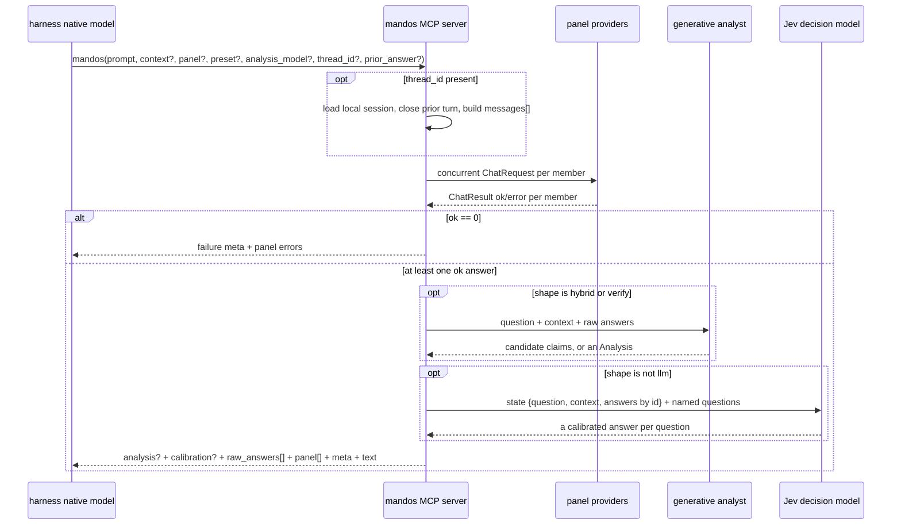

# Pipeline Workflow

Mandos runs one deliberation pipeline. Only the judge stage varies, by
`judge.shape`.

## Steps

1. `mcp_server.mandos()` validates the tool arguments through `DeliberateRequest`.
2. `panel.run_deliberation()` enforces the depth guard and the overall deadline. Every
   downstream call — panel, analyst and Jev — shares that one absolute deadline; none
   of them extends it.
3. The effective panel is resolved from request `panel`, preset `panel`, or all
   enabled providers with the `panel` role.
4. One-shot panel providers receive the same prompt and optional `CONTEXT:` block.
   Session panel providers receive reconstructed OpenAI `messages[]` with the stored
   user/assistant turn history.
5. Provider failures are captured as panel error records. Partial success is normal.
6. If every provider fails, `meta.failure` is set and the judge is skipped.
7. The judge runs the configured shape. It is given the question, **the same
   `context` the panel saw**, and every successful raw answer labelled by real
   provider id.
8. The host receives the analysis when available and all successful raw panel answers
   unconditionally. Session responses echo `thread_id` and `compacted`.

## The judge stage

See [`03-judge-shapes.md`](03-judge-shapes.md) for what each shape asks and derives.

Jev batches: question count is very nearly free because a call is answered in
parallel, so a shape builds the widest call it can rather than looping. A batch wider
than `judge.questions_per_call` (default 60) is split across calls purely to bound one
request body.

## Degradation

| Situation | Response |
|---|---|
| Some panel members fail | Successful answers still go to the judge; failed members appear in `panel[]`. |
| All panel members fail | `meta.failure = all_panels_failed`; no judge run; no raw answers. |
| Jev is unreachable, unkeyed, or errors | Fall back to the generative analyst; `meta.judge_shape = "llm"`, `meta.judge_fallback_from` names the requested shape. |
| Jev fails with no analyst configured | `analysis: null` and `meta.judge_error`; raw answers still return. |
| One Jev batch of several fails | The analysis stands on the answers that returned; a missing answer reads as maximal uncertainty; `meta.judge_error` records the partial failure. |
| `hybrid` extraction returns nothing usable | Fall back to the generative analyst. |
| `verify` verification cannot run | The analyst's analysis survives with `calibration: null`. |
| The generative judge returns malformed JSON | `meta.judge_error`; raw answers still return. |
| Depth guard trips | `meta.failure = fusion_invocation_capped`. |
| Session file is corrupt or unwritable | Current response still returns with `meta.session_warning`. |
| Session history exceeds the configured turn budget | Older turns are compacted and `compacted = true`. |

The server never authors the final answer. The harness native model authors from the
returned `analysis`, its `calibration`, and `raw_answers`.
