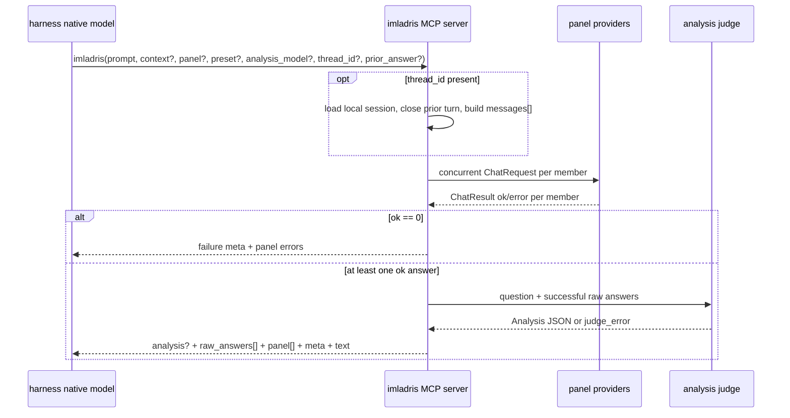

# Pipeline Workflow

Imladris runs one deliberation pipeline:

## Steps

1. `mcp_server.imladris()` validates the tool arguments through
   `DeliberateRequest`.
2. `panel.run_deliberation()` enforces the depth guard and overall deadline.
3. The effective panel is resolved from request `panel`, preset `panel`, or all
   enabled providers with the `panel` role.
4. One-shot panel providers receive the same prompt and optional `CONTEXT:` block.
   Session panel providers receive reconstructed OpenAI `messages[]` with the
   stored user/assistant turn history.
5. Provider failures are captured as panel error records. Partial success is normal.
6. If every provider fails, `meta.failure` is set and judge execution is skipped.
7. The judge receives the question plus every successful raw answer labelled by real
   provider id. It returns `Analysis` JSON only.
8. The host receives the judge analysis when available and all successful raw panel
   answers unconditionally. Session responses echo `thread_id` and `compacted`.

## Degradation

| Situation | Response |
|---|---|
| Some panel members fail | Successful answers still go to the judge; failed members appear in `panel[]`. |
| All panel members fail | `meta.failure = all_panels_failed`; no analysis; no raw answers. |
| Judge provider fails or returns malformed JSON | `meta.judge_error`; raw answers still return. |
| Depth guard trips | `meta.failure = fusion_invocation_capped`. |
| Session file is corrupt or unwritable | Current response still returns with `meta.session_warning`. |
| Session history exceeds the configured turn budget | Older turns are compacted and `compacted = true`. |

The server never authors the final answer. The harness native model authors from the
returned `analysis` and `raw_answers`.
